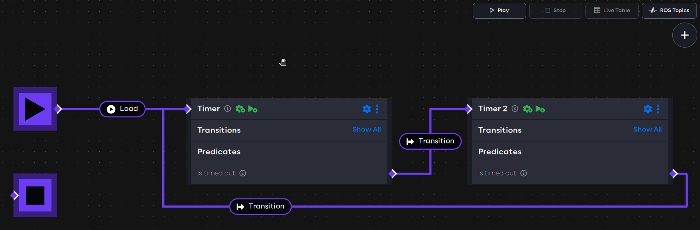
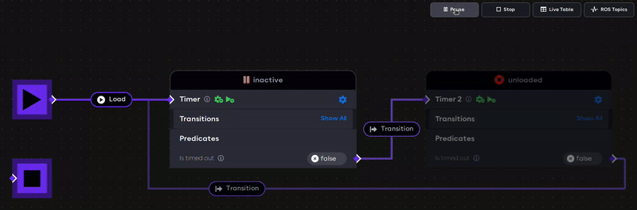

# A basic application example

This example will show how components and predicate events can be used to create dynamic behavior in an AICA
application.

## Launcher configuration requirements

This example uses AICA Core v3.1.1 in the Launcher configuration.

## Setting up the application

After starting the application container, open the Developer Interface on `localhost:8080` and press New Application.
Copy the following application code into the text box under the Editor tab, replacing the default content.

```yaml
on_start:
  load:
    component: timer
components:
  timer:
    component: base_components::utilities::Timer
    position:
      x: 200
      y: -300
    parameters:
      rate: 10
      timeout: 2.5
    events:
      is_unconfigured:
        lifecycle: configure
      is_inactive:
        lifecycle: activate
      is_timed_out:
        transition: timer_2

  timer_2:
    component: base_components::utilities::Timer
    position:
      x: 700
      y: -300
    parameters:
      rate: 10
      timeout: 2.5
    events:
      is_unconfigured:
        lifecycle: configure
      is_inactive:
        lifecycle: activate
      is_timed_out:
        transition: timer
```

Then, press the Generate Graph button. The graph should show two components connected with event edges.



## The example explained

The application begins with the `on_start` directive to list the initial application events.

```yaml
on_start:
  load:
    component: timer
```

In this case, the first event that occurs in the application is to load the `timer` component.

Application components are listed under the `components` field. Each component has a name and a registration.
The position field is used just for rendering the component on the graph.

```yaml
  timer:
    component: base_components::utilities::Timer
    position:
      x: 0
      y: -300
```

In this case, `base_components::utilities::Timer` is the registration of a built-in AICA component. It is a lifecycle
component that starts a timer when the component is activated.

Thereafter, the initial component parameters are defined.

```yaml
    parameters:
      rate: 10
      timeout: 2.5
```

All components have a `rate` parameter which defines the frequency of periodic execution steps. The default rate for
components is 10 Hertz, so 10 times per second. The component rate can be increased or decreased to make a component run
faster or slower, respectively.

The timer component has a special parameter called `timeout`, which is the duration in seconds that the timer should
be active. At the end of the timeout period, it will be in the "timed out" state.

The `events` field of a component associates component predicates with events.

```yaml
    events:
      is_unconfigured:
        lifecycle: configure
```

In this case, when the timer component is unconfigured, it triggers a lifecycle transition to configure itself.
Similarly, the next event activates the timer when it is inactive:

```yaml
      is_inactive:
        lifecycle: activate
```

When a lifecycle component configures or activates itself automatically, this is known as "auto-configure" and
"auto-activate", respectively.

Finally, the timer component has a special predicate `is_timed_out`, which is internally associated with the `timeout`
parameter.

```yaml
      is_timed_out:
        transition: timer_2
```

In this case, after the timer component has been active for 2.5 seconds, it triggers a transition event to `timer_2`.
The `transition` event from `timer` to `timer_2` is a shorthand for unloading the first component and loading the
second.

The second block describing `timer_2` is nearly identical, as the two timers are intended to have symmetrical behavior.

## Run the application

Press the Play button to start the application.

When the application is started, the `timer` component is loaded. It is initially unconfigured, which triggers it
to be configured. Thereafter, it lands in the inactive lifecycle state, which triggers it to be activated.
Once activated, the timer starts running. After 2.5 seconds (as specified by the `timeout` parameter),
the `is_timed_out` predicate goes from false to true. As a result, the `transition` event causes `timer` to be unloaded
and `timer_2` to be loaded instead. The second timer then goes through the same steps of configuring and activating
before transitioning back to the first timer.



Use the Pause button to keep the application in an idle state; components will remain loaded and active, but predicates
and events will not be handled until the application is started again.

Use the Stop button to unload all components and reset the application.

Next, learn how to edit the application using the interactive graph editor.
