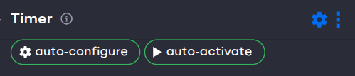

# A basic application example

This example will show how components and predicate events can be used to create dynamic behavior in an AICA
application.

## Launcher configuration requirements

This example uses AICA Core v4.0.1 in the Launcher configuration.

## Setting up the application

Launch AICA Studio and create a new application by pressing "Create new".
Copy the following application code into the text box under the Editor tab, replacing the default content.

```yaml
schema: 2-0-2
dependencies:
  core: v4.0.1
on_start:
  load:
    component: timer
components:
  timer:
    component: aica_core_components::utility::Timer
    display_name: Timer
    events:
      transitions:
        on_load:
          lifecycle:
            component: timer
            transition: configure
        on_configure:
          lifecycle:
            component: timer
            transition: activate
      predicates:
        is_timed_out:
          transition: timer_2
    parameters:
      timeout: !!float 2.0
  timer_2:
    component: aica_core_components::utility::Timer
    display_name: Timer 2
    events:
      transitions:
        on_load:
          lifecycle:
            component: timer_2
            transition: configure
        on_configure:
          lifecycle:
            component: timer_2
            transition: activate
      predicates:
        is_timed_out:
          transition: timer
    parameters:
      timeout: !!float 4.0
hardware: { }
graph:
  positions:
    stop:
      x: 0
      y: 160
    components:
      timer:
        x: 320
        y: -20
      timer_2:
        x: 840
        y: -20
```

Then, press the Generate Graph button. The graph should show two components connected with event edges.


## The example explained

The application begins with the `on_start` directive to list the initial application events.

```yaml
on_start:
  load:
    component: timer
```

In this case, the first event that occurs in the application is to load the `timer` component.

Application components are listed under the `components` field. Each component has a name and a registration.
The display name field is used just for rendering the component on the graph.

```yaml
  timer:
    component: aica_core_components::utility::Timer
    display_name: Timer
```

In this case, `aica_core_components::utility::Timer` is the registration of a built-in AICA component. It is a lifecycle
component that starts a timer when the component is activated.

Thereafter, the initial component parameters are defined.

```yaml
    parameters:
      rate: !!float 5.0
      timeout: !!float 2.0
```

All components have a `rate` parameter which defines the frequency of periodic execution steps. The default rate for
components is 10 Hertz, so 10 times per second. The component rate can be increased or decreased to make a component run
faster or slower, respectively.

The timer component has a special parameter called `timeout`, which is the duration in seconds that the timer should
be active. At the end of the timeout period, it will be in the "timed out" state.

:::info

The `!!float` tag is used to distinguish floating-point parameters from integer parameters in the YAML. Some YAML
document parsers, formatters or emitters would round a value such as `5.0` to the "equivalent" integer value `5`.
AICA Studio automatically adds the `!!float` tag to ensure that the Event Engine always parses the parameter as a
floating-point value.

:::

The `events` field of a component associates component state transitions and predicates with events.

```yaml
    events:
      transitions:
        on_load:
          lifecycle:
            component: timer
            transition: configure
```

In this case, when the timer component is loaded, it triggers a lifecycle transition to configure itself.
Similarly, the next event activates the timer when it is configured:

```yaml
        on_configure:
          lifecycle:
            component: timer
            transition: activate
```

When a lifecycle component configures or activates itself automatically, this is known as "auto-configure" and
"auto-activate", respectively. The graph shows these events with the green icons next to the component name.



Finally, the timer component has a special predicate `is_timed_out`, which is internally associated with the `timeout`
parameter.

```yaml
      predicates:
        is_timed_out:
          transition: timer_2
```

In this case, after the timer component has been active for 2 seconds, it triggers a transition event to `timer_2`.
The `transition` event from `timer` to `timer_2` is a shorthand for unloading the first component and loading the
second.

The second block describing `timer_2` is nearly identical (apart from a different value for the `timeout` parameter), as
the two timers are intended to have symmetrical behavior.

## Run the application

Press the Play button to start the application.

When the application is started, the `timer` component is loaded. It is initially unconfigured, which triggers it
to be configured. Thereafter, it lands in the inactive lifecycle state, which triggers it to be activated.
Once activated, the timer starts running. After 2 seconds (as specified by the `timeout` parameter), the `is_timed_out`
predicate goes from false to true. As a result, the `transition` event causes `timer` to be unloaded and `timer_2` to be
loaded instead. The second timer then goes through the same steps of configuring and activating before transitioning
back to the first timer.


In the AICA System, events are the key drivers of application logic. While the application is running, events can be
triggered automatically from transitions or predicates, as seen in this example, but also by other event sources such
as conditions, sequences, interactive trigger buttons in AICA Studio and even external API calls.

It is possible to pause an application using the Pause control, which has the effect of blocking any and all events from
being triggered. When an application is paused, all components will remain in their current state; any components and
controllers that are loaded and active will keep running according to their current states. Only the triggering and
automatic propagation of events is paused.

Try pausing the application and see how the state of the timers can be prevented from changing. Notice how pausing the
application while a timer is active does not prevent it from counting towards its timeout threshold, and that resuming
the application after the elapsed time has passed will then immediately trigger the waiting transition.

Finally, use the Stop button to stop the application. This will deactivate and unload all components and controllers
and fully reset the application.

Next, learn how to edit the application using the interactive graph editor.
