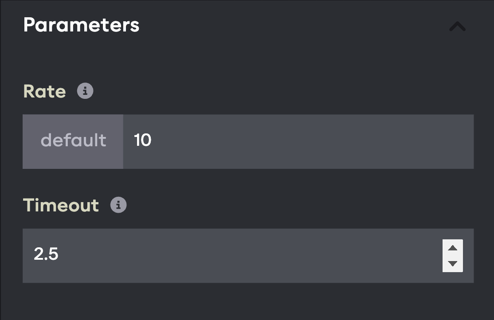
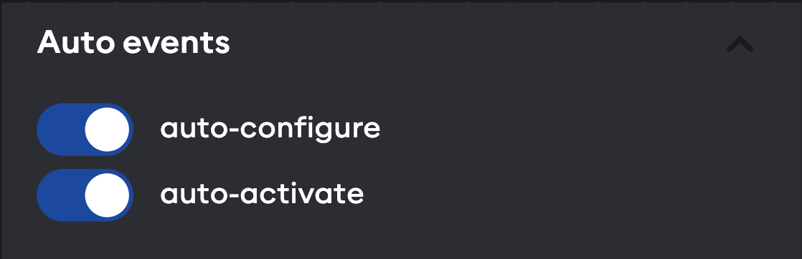

# The application graph editor

In the previous steps, an example application graph was generated from YAML. The graph can also be edited interactively
and any changes will automatically be written back to the YAML representation.

## Using the application graph editor

Drag the background to pan the graph view and scroll to zoom in or out. Click the arrow icons on the central divider
on the page to expand either the code editor or graph view to full screen.

You can also use the graph control buttons on the bottom left to zoom and fit the view. The mini-map on the bottom right
can also be used to navigate around the graph.

<!-- TODO: parameters and auto-lifecycle events are no longer dropdowns, but part of the Parameter editor view -->

## Setting component parameters



Component parameters can be edited directly in the graph view.
Click on the Parameter dropdown of one of the timer components in the graph and look for the Timeout parameter field.
Try changing the number to a different value in seconds, and look for the corresponding change in the code editor.
Then press play on the application and observe that the timer now has a different duration before triggering the
"Is timed out" predicate.

## Auto-lifecycle events



Because the timer components are lifecycle components, they only count down the time when they are active. By default,
the "Load" or "Transition" events start the lifecycle component in an unconfigured state. The "auto-configure" and
"auto-activate" toggle switches on the component can be used to enable or disable
[auto lifecycle events](../../concepts/05-building-blocks/03-components.md#auto-lifecycle-events).

When both toggle switches are enabled, the YAML code will show the corresponding events for the componnts:

```yaml
    events:
      is_unconfigured:
        lifecycle: configure
      is_inactive:
        lifecycle: activate
```

Disabling one or both auto event switches will also remove the corresponding events from the YAML, while enabling the
switch will regenerate the event in the YAML.

<!-- TODO: Replace the following sections with adding interactive buttons 

Show how we can:
- go to the sidebar
- click on add trigger button
- drag to reposition
- create an event edge to the timer
- choose the event type (e.g. deactivate)
- rename the button

Repeat for a second button to show manual deactivation / activation

Then say: now that we learned to add buttons and create event edges, try to do the same for components. As an exercise,
search for and add timer components, set thea auto-lifecycle events, and connect the transition edges to recreate the
example from scratch.
-->

## Creating and deleting event edges

The timers are connected with a Transition event edge. To change the event type on an edge, click on the label. This
will open a selection menu showing other available event types (for example, Load, Unload, Configure...). Choosing
a different event type will close the selection menu and update the YAML code accordingly.


Clicking on an edge also selects it, which is indicated by the increased line thickness. Clicking away from the edge
will deselect it. While the edge is selected, press the delete key to delete the edge. This will also remove the
event from the YAML representation.

To create a new edge, move the mouse over the event source handle next to a component predicate until the cursor changes
to a targeting reticule. Then, click and drag to create a draft edge. Pull it towards a target handle (on the top left
of a component) until the cursor changes again and the draft edge snaps in place, then let go of the mouse button.

If the connection is valid, it will create a new event edge with the default event (Load).

## Adding and deleting components

Components can be added to the graph using the component sidebar menu; press the (+) button in the corner of the graph
to open the sidebar. At the top, you will see two special entries "Event Trigger" and "Hardware Interface", which will
be explained in a later example. These are followed by a list of components with a name and brief description.

Try to add a third timer component to the application using the graph editor. Search for "timer" in the search field and
then click on the Timer component. A new component should appear on the graph and in the code.

The sidebar menu can be closed by clicking anywhere in the graph. Click and drag on the component to change its position
in the graph. This will also update the associated position in the code editor.

To delete a component, press the small menu icon in the top right corner of the component, then click Remove.

As an exercise, delete all the components and try to recreate the timer application example from scratch using only the
graph editor. Remember to set a timeout value in the component parameters.
