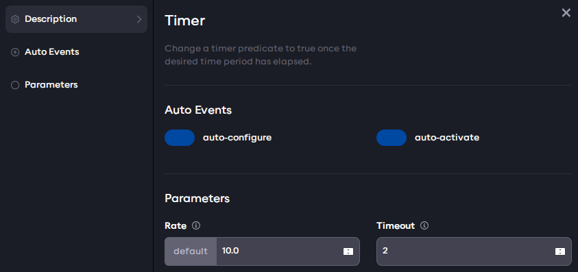

# The application graph editor

In the previous steps, an example application graph was generated from YAML. The graph can also be edited interactively
and any changes will automatically be written back to the YAML representation.

## Using the application graph editor

Drag the background to pan the graph view and scroll to zoom in or out. Click the arrow icons on the central divider
on the page to expand either the code editor or graph view to full screen.

You can also use the graph control buttons on the bottom left to zoom and fit the view. The mini-map on the bottom right
can also be used to navigate around the graph.

Component parameters and settings are also available through the AICA Studio. Click on the gear icon of the first Timer
component to open its settings page and learn about auto-lifecycle events and component parameters in the sections
below.



## Auto-lifecycle events

Because the timer components are lifecycle components, they only count down the time when they are active. By default,
the "Load" or "Transition" events start the lifecycle component in an unconfigured state. The "auto-configure" and
"auto-activate" toggle switches can be used to enable or disable
[auto-lifecycle events](../../concepts/05-building-blocks/03-components.md#auto-lifecycle-events).

When both toggle switches are enabled, the YAML code will show the corresponding events for the componnts:

```yaml
    events:
      transitions:
        on_load:
          lifecycle:
            component: timer
            transition: configure
        on_configure:
          lifecycle:
            component: timer
            transition: activate
```

Disabling one or both auto-lifecycle event switches will also remove the corresponding events from the YAML, while
enabling the switch will regenerate the event in the YAML.

## Setting component parameters

Component parameters can be edited directly in the settings. Try changing the value of the Timeout parameter and look
for the corresponding change in the code editor. Then press play on the application and observe that the timer now has a
different duration before triggering the "Is timed out" predicate.

<!-- TODO: explain behavior with "default" once it's working as intended -->

## Adding and deleting elements

Let's now make the example a bit more interesting by adding more elements to the graph using the sidebar menu; press the
(+) button in the corner of the graph to open the sidebar. At the top, you will see special entries
"Hardware Interface", "Trigger Events Button", "Sequence" and "Condition", for which a dedicated example is included
in later sections. These are followed by a list of components with a name and brief description.

<!-- TODO: link the examples once they exist -->

Trigger Events Buttons are interactive elements that can be used to trigger events through mouse clicks and interact
with the flow of the application. Click on the Trigger Events Button in the sidebar to add such an element to the
application. A new button should appear on the graph and in the code.

The sidebar menu can be closed by clicking anywhere in the graph. Drag the button to change its position in the graph.
This will also update the corresponding Trigger Events Button position in the code editor.

To delete an element from the graph, press the small menu icon in its top right corner, then click Remove.

## Creating and deleting event edges

To create a new edge, move the mouse over an event source handle until the cursor changes to a targeting reticule. Then,
click and drag to create a draft edge. Pull it towards a target handle (on the top left of a component) until the cursor
changes again and the draft edge snaps in place, at which point you can let go of the mouse button. If the connection is
valid, it will create a new event edge with the default event (Load). Event source handles are found under transitions
and predicates of a component and look like that:


:::note

All components have an icon on their top right that looks like an event source handle but is in fact a condition source
and creating event edges from those will not work. 

<!-- TODO: link example with conditions -->

:::

Create an event edge between the new trigger button and the Timer 2 component. Choose the Deactivate
event type in order to pause the timer on click of the button. To change the event type on an edge, click on the label.
This will open a selection menu showing other available event types (for example, Load, Unload, Configure...). Choosing
an event type will close the selection menu and update the YAML code accordingly.


Clicking on an edge also selects it, which is indicated by the increased line thickness. Clicking away from the edge
will deselect it. While the edge is selected, press the delete key to delete the edge. This will also remove the
event from the YAML representation.

Add now a second trigger button, create a new event edge to Timer 2 and choose the Activate event type.


## Renaming elements in the graph

Both buttons now still have the default "Trigger Events Button" name, which may become confusing in larger applications.
To rename an element in the graph, click on the small menu icon in its top right corner, then click Rename. Give the two
buttons a new name, for example "Pause Timer" for the button with the Deactivate event, and "Play Timer" for the button
with the Activate event.

Now, try to run the applications again and use the Pause and Play trigger buttons to deactivate and activate the
Timer 2 while it is active. Verify that once paused, the elapsed time does not count towards the component timing out
and it only times out once it has been in the active state for a total of 4 seconds. That is, deactivating the component
will freeze the timer until reactivation.

Now that we learned to add buttons and create event edges, try to do the same for components. As an exercise, search for
and add timer components, set the auto-lifecycle events, and connect the transition edges to recreate the example from
scratch using only the graph editor. Remember to set a timeout value in the component parameters.
