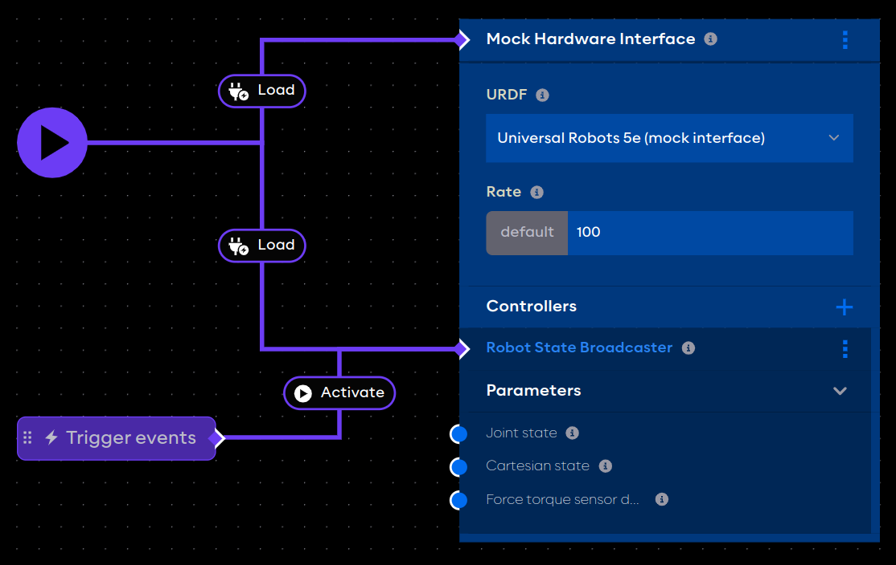

# An application with hardware

## Package requirements

This example requires the Universal Robots collection which includes example URDF content.

```toml title="aica-package.toml"
#syntax=ghcr.io/aica-technology/app-builder:v1

[packages]
"@aica/base" = "v2.1.0"

"@aica/collections/ur-collection" = "v3.0.4"
```

## URDF Hardware Manager

After starting the application container, open the Hardware tab of the Developer
Interface ([localhost:8080/dev/hardware](http://localhost:8080/dev/hardware)). This page shows a table of available URDF
files in the container database with a name and a description.

AICA hardware collections include example URDFs, which are shown on the table with a pad-lock icon indicating that they
are not editable. Users can make an editable copy of a selected URDF with the "Save As" button, or upload and edit
custom URDFs.

:::note

Refer to the section on [Persistent user data](../04-run.md#persistent-user-data) on how to mount a container volume to
persist database content between containers.

:::

From the hardware manager table, select the entry named "Universal Robots 5e (mock interface)". The URDF content should
appear on the right side of the page.

```xml title="Universal Robots 5e (mock interface)"
<?xml version="1.0" ?>
<robot name="ur5e">
    <ros2_control name="UniversalRobotsInterface" type="system">
        <hardware>
            #highlight-next-line
            <plugin>robot_interface/MockInterface</plugin>
        </hardware>
        ...
    </ros2_control>
</robot>
```

The selected URDF specifies the hardware plugin `robot_interface/MockInterface`. This is a generic AICA plugin that
mocks real robot hardware by perfectly following all commands and reflecting back the robot state.

The mock URDF will be used to demonstrate the hardware interface block in AICA applications.

:::info

Refer to the overview section [Controlling robots with ros2_control](../../concepts/03-ros-concepts/04-control.md) for
more context.

:::

## Setting up the application

Go to the Editor page using the top navigation bar or at [localhost:8080/dev/editor](http://localhost:8080/dev/editor)
and create a new application.

Enter the following YAML and generate the graph.

```yaml
on_start:
  load:
    - hardware: mock_hardware
    - controller: robot_state_broadcaster
      hardware: mock_hardware
buttons:
  activate_controller:
    position:
      x: 0
      y: 280
    on_click:
      switch_controllers:
        hardware: mock_hardware
        activate: robot_state_broadcaster
components: { }
hardware:
  mock_hardware:
    display_name: Mock Hardware Interface
    position:
      x: 400
      y: -80
    urdf: Universal Robots 5e (mock interface)
    rate: 60
    controllers:
      robot_state_broadcaster:
        plugin: modulo_controllers/RobotStateBroadcaster
```

The application graph should show a hardware interface with a controller and an event trigger.



## The example explained

Starting from the bottom, the top-level `hardware` field defines the hardware interfaces in an application.

In this case, there is one hardware interface called `mock_hardware`.

```yaml
  mock_hardware:
    display_name: Mock Hardware Interface
    position:
      x: 400
      y: -80
    urdf: Universal Robots 5e (mock interface)
    controllers:
      robot_state_broadcaster:
        plugin: modulo_controllers/RobotStateBroadcaster
```

The `urdf` field specifies the `Universal Robots 5e (mock interface)` URDF as identified on the hardware manager page.

The `controllers` field lists the controllers associated with the hardware interface. In this example, the only
controller is the `modulo_controllers/RobotStateBroadcaster`, which is a generic AICA controller that broadcasts the
robot joint states and transforms.

:::tip

Learn more about available properties for application hardware on
the [YAML application syntax](../../reference/02-yaml-syntax.md) reference page.

:::

Moving up the application, the `components` field is left empty because there are no components in this example.

```yaml
components: { }
```

Above that, the application defines an event trigger button under the top-level `buttons` field.

```yaml
buttons:
  activate_controller:
    position:
      x: 0
      y: 280
    on_click:
      switch_controllers:
        hardware: mock_hardware
        activate: robot_state_broadcaster
```

The `on_click` field defines the application events that are triggered with the event button is pressed. In this case,
it triggers the `switch_controllers` event which is used to activate the `robot_state_broadcaster` controller on the
`mock_hardware` interface.

The application begins with the `on_start` directive to list the initial application events.

```yaml
on_start:
  load:
    - hardware: mock_hardware
    - controller: robot_state_broadcaster
      hardware: mock_hardware
```

In this case, the first event that occurs in the application is to load the `mock_hardware` hardware interface.
After that, the `robot_state_broadcaster` controller is loaded.

## Run the application

Putting it all together, pressing Play on this application should load the mock hardware interface and load the
broadcaster controller. When the trigger button is pressed in the graph editor, the broadcaster will be activated.

:::caution

The loading behavior of hardware interfaces and controllers may change in future versions to simplify "auto-load"
procedures similar
to [component auto-lifecycle events](../../concepts/05-building-blocks/03-components.md#auto-lifecycle-events)

:::

## Visualize the mock robot in RViz

:::info

Only users with a Linux host can visualize the robot with RViz. Follow the steps in
the [Display sharing](../04-run.md#display-sharing) section to attach a new terminal to the running container.

:::

Open RViz in the container with the `rviz2` command.

In the Displays panel under Global Options, set the Fixed Frame to `world`.

Press Add or CTRL+N to add a new display and select the RobotModel plugin.

Under the RobotModel Description Topic, enter `/mock_hardware/robot_description`.

:::tip

The robot description topic will correspond to the name of the hardware interface in the YAML application.

:::

When the application is playing and the robot broadcaster controller has been activated, the robot model should appear
in the RViz viewer.


<!-- TODO
The next example will add another controller to the mock hardware to move the robot based on a component output.
-->
